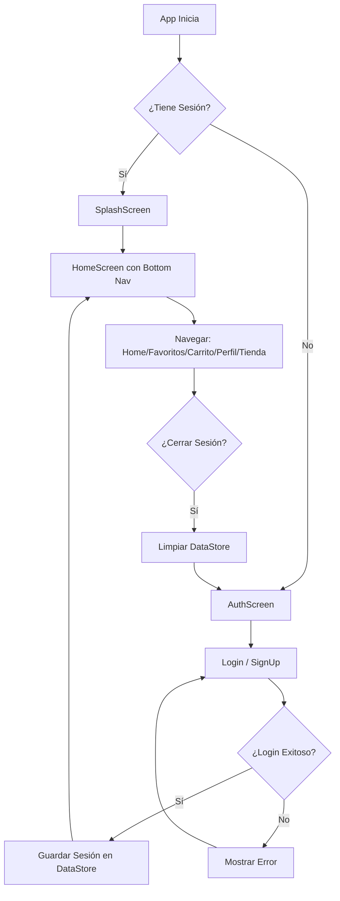

# 📱 ShopPly - Sistema de Autenticación y Navegación

APK: https://drive.google.com/file/d/1dyPWVVwVgTy9ILZMd3rPtVb1XVokpOBB/view?usp=sharing

Repository

- GitHub: https://github.com/Joshep-c/ShopPly

Clone

```powershell
# Clona el repositorio (Windows PowerShell)
git clone https://github.com/Joshep-c/ShopPly.git
``` 

## 📋 Resumen de Implementación

Este documento describe la arquitectura completa del sistema de autenticación, navegación y estructura de pantallas de la aplicación **ShopPly**, un e-commerce tipo "Mini Amazon para PYMEs peruanas".

---

## 🔖 READMEs por módulo

Esta repo contiene README por módulo y submódulo para facilitar la navegación y la incorporación de colaboradores. Los README principales que encontrarás en esta rama son:

- `app/README.md` — Vista general del módulo Android y cómo compilar la app.
- `data/README.md` — Descripción del módulo de datos (repositorios, Room, DataStore).
- `core/README.md` — Utilidades y librerías compartidas.
- `domain/README.md` — Entidades y casos de uso de negocio.
- `feature-catalog/README.md` — Features independientes (si aplica).
- `app/src/main/java/.../di/README.md` — Módulos y proveedores de Hilt.
- `app/src/main/java/.../data/README.md` — Repositorios, DAOs, base de datos y migraciones.
- `app/src/main/java/.../ui/README.md` — Arquitectura de UI: NavGraph, pantallas y patrones (MVVM/StateFlow).

Cada README incluye: propósito, contratos públicos (entradas/salidas), cómo ejecutar tareas locales y enlaces a piezas relevantes (migrations, pruebas, ejemplos).

## 📚 Docs auxiliares

Además de los README por módulo, hay documentación auxiliar técnica útil para desarrolladores:

- `docs/DB-MIGRATIONS.md` — instrucciones y ejemplos para gestionar migraciones de Room.
- `docs/DATASEEDER.md` — cómo funciona el `DataSeeder`, métodos y cuándo usarlo.
- `docs/LOCAL_STORAGE.md` — detalles del `LocalStorageService` (guardar/eliminar imágenes, URIs, notas).
- `docs/METHODS.md` — resumen rápido de métodos clave en repositorios, DAOs y ViewModels.

Estos documentos ayudan a entender operaciones comunes sin explorar todo el código base inicialmente.


## 🏗️ Arquitectura General

### **Patrón MVVM + Clean Architecture**

```
┌─────────────────────────────────────────────────────────────┐
│                     MainActivity                             │
│  - Inicializa la base de datos                              │
│  - Gestiona el estado global con MainViewModel              │
│  - Punto de entrada de la aplicación                        │
└──────────────────┬──────────────────────────────────────────┘
                   │
                   ▼
┌─────────────────────────────────────────────────────────────┐
│                    MainViewModel                             │
│  - Verifica estado de autenticación al inicio               │
│  - Determina pantalla inicial (Splash/Auth/Home)            │
│  - Gestiona estados: Loading, Authenticated, Unauthenticated│
└──────────────────┬──────────────────────────────────────────┘
                   │
                   ▼
┌─────────────────────────────────────────────────────────────┐
│                      NavGraph                                │
│  - Sistema de navegación con Jetpack Compose Navigation    │
│  - Rutas: Auth, Login, SignUp, Home (con bottom nav)       │
└─────────────────────────────────────────────────────────────┘
```

---

## 🔐 Flujo de Autenticación

### **1. Inicio de la Aplicación**

```kotlin
// MainActivity.kt
@Composable
private fun MainContent(
    modifier: Modifier = Modifier,
    viewModel: MainViewModel
) {
    val uiState by viewModel.uiState.collectAsState()

    when (uiState) {
        is MainUiState.Loading -> {
            // ✅ Muestra SplashScreen mientras verifica sesión
            SplashScreen(modifier = modifier)
        }
        is MainUiState.Authenticated -> {
            // ✅ Usuario tiene sesión activa -> Ir a Home
            NavGraph(
                modifier = modifier,
                startDestination = Screen.Home.route,
                userRepository = userRepository
            )
        }
        is MainUiState.Unauthenticated -> {
            // ✅ Sin sesión -> Mostrar pantalla de bienvenida
            NavGraph(
                modifier = modifier,
                startDestination = Screen.Auth.route,
                userRepository = userRepository
            )
        }
    }
}
```

**Flujo:**
1. **App inicia** → `MainViewModel` verifica si hay sesión guardada
2. **Si hay sesión** → Auto-login y navega a `HomeScreen` (pantalla principal)
3. **Sin sesión** → Muestra `AuthScreen` (bienvenida)

---

### **2. Login Manual**

```kotlin
// AuthViewModel.kt - Manejo de Login
fun login() {
    if (!validateLoginInput()) return

    viewModelScope.launch {
        _uiState.value = AuthUiState.Loading

        when (val result = userRepository.login(loginEmail, loginPassword)) {
            is Result.Success -> {
                isLoggedIn = true
                _uiState.value = AuthUiState.Success("¡Bienvenido ${result.data.name}!")
            }
            is Result.Error -> {
                _uiState.value = AuthUiState.Error(
                    result.exception.message ?: "Error al iniciar sesión"
                )
            }
        }
    }
}
```

**Características:**
- ✅ Validación de email y contraseña
- ✅ Estados reactivos con `StateFlow`
- ✅ Mensajes de error detallados
- ✅ Guarda sesión en DataStore (persistencia)

---

### **3. Registro de Usuarios**

```kotlin
// AuthViewModel.kt - Registro con selección de rol
fun register() {
    if (!validateRegisterInput()) return

    viewModelScope.launch {
        _uiState.value = AuthUiState.Loading

        // Determinar el rol según el tipo de cuenta
        val userRole = if (isBusinessAccount) UserRole.SELLER else UserRole.BUYER

        when (val result = userRepository.register(
            email = registerEmail,
            name = registerName,
            password = registerPassword,
            phone = registerPhone.takeIf { it.isNotBlank() },
            userRole = userRole
        )) {
            is Result.Success -> {
                isLoggedIn = true
                _uiState.value = AuthUiState.Success("¡Cuenta creada exitosamente!")
            }
            is Result.Error -> {
                _uiState.value = AuthUiState.Error(result.exception.message)
            }
        }
    }
}
```

**Tipos de Cuenta:**
- 👤 **Comprador (BUYER):** Acceso a catálogo, carrito, favoritos
- 🏪 **Vendedor (SELLER):** Acceso adicional a gestión de tienda
- 👑 **Admin (ADMIN):** Panel de administración de tiendas

---

## 🧭 Sistema de Navegación

### **Navegación por Roles**

```kotlin
// BottomNavItem.kt - Barra inferior dinámica según rol
fun getBottomNavItems(userRole: UserRole): List<BottomNavItem> {
    return when (userRole) {
        UserRole.BUYER -> {
            listOf(
                BottomNavItem("Inicio", Icons.Default.Home, Screen.Home.route),
                BottomNavItem("Favoritos", Icons.Default.Favorite, Screen.Favorites.route),
                BottomNavItem("Carrito", Icons.Default.ShoppingCart, Screen.Cart.route),
                BottomNavItem("Perfil", Icons.Default.Person, Screen.Profile.route)
            )
        }
        UserRole.SELLER -> {
            listOf(
                BottomNavItem("Inicio", Icons.Default.Home, Screen.Home.route),
                BottomNavItem("Favoritos", Icons.Default.Favorite, Screen.Favorites.route),
                BottomNavItem("Carrito", Icons.Default.ShoppingCart, Screen.Cart.route),
                BottomNavItem("Tienda", Icons.Default.Store, Screen.Store.route), // ⭐ Extra
                BottomNavItem("Perfil", Icons.Default.Person, Screen.Profile.route)
            )
        }
        UserRole.ADMIN -> {
            listOf(
                BottomNavItem("Inicio", Icons.Default.Home, Screen.Home.route),
                BottomNavItem("Favoritos", Icons.Default.Favorite, Screen.Favorites.route),
                BottomNavItem("Carrito", Icons.Default.ShoppingCart, Screen.Cart.route),
                BottomNavItem("Tiendas", Icons.Default.Store, Screen.AdminStores.route), // ⭐ Admin
                BottomNavItem("Perfil", Icons.Default.Person, Screen.Profile.route)
            )
        }
    }
}
```

---

### **Rutas Principales**

```kotlin
// Screen.kt - Definición de rutas
sealed class Screen(val route: String) {
    // Autenticación
    data object Auth : Screen("auth")           // Pantalla de bienvenida
    data object Login : Screen("login")         // Login
    data object SignUp : Screen("signup")       // Registro

    // Principales (con bottom nav)
    data object Home : Screen("home")           // 🏠 Pantalla principal (productos, banners)
    data object Favorites : Screen("favorites") // ❤️ Favoritos
    data object Cart : Screen("cart")           // 🛒 Carrito de compras
    data object Profile : Screen("profile")     // 👤 Perfil de usuario

    // Específicas de rol
    data object Store : Screen("store")         // 🏪 Gestión de tienda (SELLER)
    data object AdminStores : Screen("admin_stores") // 👑 Panel admin (ADMIN)

    // Con argumentos
    data object ProductDetail : Screen("product/{productId}") {
        fun createRoute(productId: String) = "product/$productId"
    }
}
```

---

## 🏠 Pantalla Principal (HomeScreen)

### **Diseño de HomeScreen**

La pantalla principal muestra un feed estilo e-commerce con:

```kotlin
// HomeScreen.kt - Estructura
@Composable
fun HomeScreen(
    modifier: Modifier = Modifier,
    viewModel: HomeViewModel,
    onLogout: () -> Unit
) {
    Scaffold(
        topBar = {
            TopAppBar(
                title = { Text("ShopPly") },
                actions = {
                    IconButton(onClick = { /* Buscar */ }) {
                        Icon(Icons.Default.Search, "Buscar")
                    }
                    IconButton(onClick = { /* Notificaciones */ }) {
                        Icon(Icons.Default.Notifications, "Notificaciones")
                    }
                }
            )
        }
    ) { paddingValues ->
        LazyColumn(modifier = Modifier.padding(paddingValues)) {
            // ✅ Saludo personalizado
            item { GreetingSection(userName = user.name) }
            
            // ✅ Banners promocionales (scroll horizontal)
            item { PromotionalBanners() }
            
            // ✅ Categorías (Electrónica, Ropa, Hogar, etc.)
            item { CategoriesSection() }
            
            // ✅ Productos recomendados
            item { RecommendedProducts() }
            
            // ✅ Ofertas especiales
            item { SpecialOffers() }
        }
    }
}
```

**Componentes Principales:**

1. **Saludo Personalizado**
```kotlin
Card(colors = CardDefaults.cardColors(
    containerColor = MaterialTheme.colorScheme.primaryContainer
)) {
    Row {
        Icon(Icons.Default.Person, modifier = Modifier.size(48.dp))
        Column {
            Text("¡Hola, $userName!", style = Typography.titleLarge)
            Text("¿Qué deseas comprar hoy?")
        }
    }
}
```

2. **Banners con Gradientes**
```kotlin
// 3 banners con animación horizontal
LazyRow {
    items(3) { index ->
        Card(shape = RoundedCornerShape(16.dp)) {
            Box(modifier = Modifier.background(gradients[index])) {
                Text("¡Oferta del día!", color = Color.White)
            }
        }
    }
}
```

3. **Categorías**
```kotlin
LazyRow {
    items(listOf("Electrónica", "Ropa", "Hogar", "Deportes", "Libros")) { cat ->
        CategoryItem(name = cat, icon = Icons.Default.Phone)
    }
}
```

4. **Productos Recomendados**
```kotlin
// Cards con imagen, nombre, precio, rating
@Composable
fun ProductCard(index: Int, isOffer: Boolean = false) {
    Card {
        Column {
            Box { // Imagen placeholder
                Icon(Icons.Default.ShoppingBag, modifier = Modifier.size(64.dp))
                if (isOffer) {
                    Card { Text("-20%", color = Color.White) } // Badge de descuento
                }
            }
            Text("Producto $index")
            Text("S/ ${index * 50}.00", fontWeight = FontWeight.Bold)
            Row {
                Icon(Icons.Default.Star, tint = Color(0xFFFFA000))
                Text("4.$index")
            }
        }
    }
}
```

---

## 💾 Persistencia de Datos

### **UserRepository - Gestión de Sesión**

```kotlin
class UserRepository @Inject constructor(
    private val userDao: UserDao,
    private val userPreferences: UserPreferences
) {
    // ✅ Login: Verifica credenciales + Guarda sesión
    suspend fun login(email: String, password: String): Result<User> {
        val user = userDao.getUserByEmailAndPassword(email, password)
        return if (user != null) {
            userPreferences.saveUserId(user.userId) // ⭐ Guardar en DataStore
            Result.Success(user)
        } else {
            Result.Error(Exception("Credenciales incorrectas"))
        }
    }

    // ✅ Verificar si hay sesión activa
    suspend fun isLoggedIn(): Boolean {
        val userId = userPreferences.getUserId().first()
        return userId != null
    }

    // ✅ Obtener usuario actual
    fun getCurrentUser(): Flow<User?> {
        return userPreferences.getUserId().flatMapLatest { userId ->
            if (userId != null) {
                userDao.getUserById(userId)
            } else {
                flowOf(null)
            }
        }
    }

    // ✅ Logout: Limpia sesión
    suspend fun logout() {
        userPreferences.clearUserId()
    }
}
```

**Tecnologías:**
- 🗄️ **Room Database:** Almacena usuarios, productos, órdenes
- 💾 **DataStore Preferences:** Guarda `userId` de sesión activa
- 🔄 **Kotlin Flow:** Datos reactivos

---

## 🎨 Pantallas Implementadas

| Pantalla | Descripción | Rol |
|----------|-------------|-----|
| `AuthScreen` | Bienvenida con botones Login/Registro | Todos |
| `LoginScreen` | Formulario de inicio de sesión | Todos |
| `SignUpScreen` | Registro con selector de rol (Comprador/Vendedor) | Todos |
| `HomeScreen` | **Pantalla principal** con productos, banners, categorías | Todos |
| `FavoritesScreen` | Lista de productos favoritos | Todos |
| `CartScreen` | Carrito de compras | Todos |
| `ProfileScreen` | Perfil de usuario + botón de cerrar sesión | Todos |
| `StoreScreen` | Gestión de tienda (agregar productos, inventario) | SELLER |
| `AdminStoresScreen` | Panel de administración de tiendas | ADMIN |

---

## 🔧 Buenas Prácticas Implementadas

### **1. Separación de Responsabilidades**
- ✅ `MainActivity`: Solo configura UI, delega lógica a ViewModel
- ✅ `MainViewModel`: Gestiona estado de autenticación
- ✅ `UserRepository`: Capa de datos (abstracción de Room + DataStore)

### **2. Estados Reactivos**
```kotlin
// Uso de StateFlow para estados observables
sealed class AuthUiState {
    data object Idle : AuthUiState()
    data object Loading : AuthUiState()
    data class Success(val message: String) : AuthUiState()
    data class Error(val message: String) : AuthUiState()
}
```

### **3. Inyección de Dependencias con Hilt**
```kotlin
@HiltViewModel
class AuthViewModel @Inject constructor(
    private val userRepository: UserRepository
) : ViewModel()
```

### **4. Navegación Type-Safe**
```kotlin
// Rutas con argumentos tipados
data object ProductDetail : Screen("product/{productId}") {
    fun createRoute(productId: String) = "product/$productId"
}
```

### **5. Validación de Inputs**
```kotlin
private fun validateLoginInput(): Boolean {
    when {
        loginEmail.isBlank() -> {
            _uiState.value = AuthUiState.Error("Ingresa tu email")
            return false
        }
        !Patterns.EMAIL_ADDRESS.matcher(loginEmail).matches() -> {
            _uiState.value = AuthUiState.Error("Email inválido")
            return false
        }
        loginPassword.length < 6 -> {
            _uiState.value = AuthUiState.Error("Contraseña debe tener al menos 6 caracteres")
            return false
        }
    }
    return true
}
```

---

## 📊 Flujo Completo de Usuario



---

## 🔑 Credenciales de Prueba

```kotlin
// Usuarios pre-cargados en la base de datos
Comprador:
  Email: comprador@gmail.com
  Password: buyer123

Vendedor:
  Email: tech@arequipa.pe
  Password: seller123

Admin:
  Email: admin@shopply.pe
  Password: admin123
```

---

## 📦 Dependencias Principales

```kotlin
// build.gradle.kts (app)
dependencies {
    // Jetpack Compose
    implementation("androidx.compose.ui:ui:1.7.2")
    implementation("androidx.navigation:navigation-compose:2.8.0")
    
    // Hilt (Inyección de Dependencias)
    implementation("com.google.dagger:hilt-android:2.48")
    kapt("com.google.dagger:hilt-compiler:2.48")
    implementation("androidx.hilt:hilt-navigation-compose:1.2.0")
    
    // Room Database
    implementation("androidx.room:room-runtime:2.6.1")
    implementation("androidx.room:room-ktx:2.6.1")
    ksp("androidx.room:room-compiler:2.6.1")
    
    // DataStore (Preferencias)
    implementation("androidx.datastore:datastore-preferences:1.1.1")
    
    // Material 3
    implementation("androidx.compose.material3:material3")
}
```

---

## 🚀 Próximas Funcionalidades

- [ ] Implementar búsqueda de productos
- [ ] Sistema de notificaciones push
- [ ] Detalle de producto con galería de imágenes
- [ ] Carrito funcional con checkout
- [ ] Integración con pasarelas de pago
- [ ] Sistema de valoraciones y reseñas
- [ ] Chat vendedor-comprador
- [ ] Dashboard de vendedor con estadísticas
- [ ] Sistema de órdenes y seguimiento

---

## 📝 Conclusión

La aplicación **ShopPly** implementa un sistema robusto de autenticación y navegación siguiendo las mejores prácticas de Android moderno:

✅ **Arquitectura MVVM** con separación clara de capas  
✅ **Navegación dinámica** según rol de usuario  
✅ **Persistencia de sesión** con DataStore  
✅ **UI moderna** con Material Design 3  
✅ **Escalable** y listo para agregar nuevas funcionalidades  

---

**Desarrollado con:** Kotlin, Jetpack Compose, Room, Hilt, Navigation Component  
**Fecha:** Noviembre 2025  
**Versión:** 1.0.0

